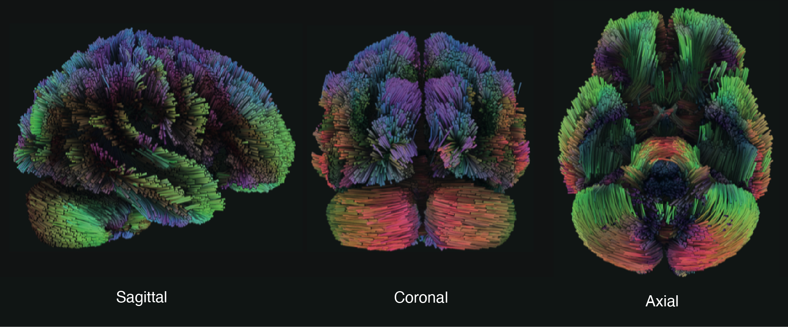

# White Matter Tract Explorer

An interactive three-dimensional visualization of white matter pathways in the human brain. Developed in 2023 as an educational tool for neuroscience students, researchers, and anyone interested in neuroanatomy.

**[View Live Application →](https://omar-chishti.github.io)**



---

## Overview

This web-based application presents 25 major white matter tracts derived from high-resolution diffusion MRI tractography data. Built using modern web technologies (WebGL, Web Components), it provides an intuitive interface for exploring the structural connectivity of the human brain with support for augmented reality on compatible devices.

## Features

**Visualization**
- Interactive 3D models with camera controls (rotate, zoom, pan)
- Categorized tract selection organized by neuroanatomical function
- Optional transparent brain overlay for anatomical context
- Deep linking to specific tracts via URL parameters
- Dynamic page titles reflecting current selection

**Interface**
- Classical typography (Cinzel and Crimson Text)
- Light and dark viewing modes
- Keyboard shortcuts for efficient navigation
- Responsive design for desktop and mobile devices
- Augmented reality view on compatible devices

**Technical**
- Pure HTML5, CSS3, and vanilla JavaScript
- No framework dependencies
- Schema.org structured data for academic SEO
- Optimized GLB model format for fast loading

## White Matter Tracts

The visualization includes 25 hand-modeled fiber pathways:

**Association Tracts** — *Connecting regions within the same hemisphere*
- Arcuate Fasciculus (L_AF)
- Cingulum (L_CG)
- Extreme Capsule (L_EMC)
- Frontal Aslant Tract (L_FAT)
- Inferior Frontooccipital Fasciculus (L_IFOF)
- Inferior Longitudinal Fasciculus (L_ILF)
- Middle Longitudinal Fasciculus (L_mLF)
- Parietal Aslant Tract (L_PAT)
- Superior Longitudinal Fasciculus (L_SLF)
- Uncinate Fasciculus (L_UF)
- Vertical Occipital Fasciculus (L_VOF)

**Projection Tracts** — *Connecting cortex with subcortical structures*
- Acoustic Radiation (AR_L)
- Corticobulbar Tract (CBT_L)
- Corticopontine Tract (CPT_L)
- Corticostriatal Tract (CS_L)
- Corticospinal Tract (CST_L)
- Dentatorubrothalamic Tract (DRTT_L)
- Fornix (F_L)
- Medial Lemniscus (ML_L)
- Optic Radiation (OR_L)
- Reticulospinal Tract (RST_L)
- Thalamic Radiation (TR_L)

**Commissural Tracts** — *Connecting the two hemispheres*
- Anterior Commissure (AC)
- Corpus Callosum (CC)

**Cerebellar Structure**
- Cerebellum (L_CB)

## Controls

**Mouse and Touch**
- Rotate: Click and drag (single-finger drag on touch)
- Zoom: Scroll wheel (pinch gesture on touch)
- Pan: Right-click and drag (two-finger drag on touch)

**Keyboard Shortcuts**
- `i` or `?` — Open information modal
- `Esc` — Close modal
- `d` — Toggle dark mode
- `b` — Toggle brain overlay

**Deep Linking**
- Share specific tracts using URL parameters: `?tract=L_AF.glb`
- Example: [Arcuate Fasciculus](https://omar-chishti.github.io/?tract=L_AF.glb)

## Browser Support

- Chrome/Edge 90+ (recommended)
- Safari 14+
- Firefox 88+
- Mobile browsers: iOS 12+, Android 8+
- AR capabilities: ARCore (Android) and ARKit (iOS)

## Technical Implementation

**Architecture**
- Google Model Viewer web component for 3D rendering
- GLB format models with transparent brain overlay variants
- LocalStorage for persistent user preferences
- URL parameter handling for shareable tract links

**Typography**
- Cinzel (inspired by Roman inscriptions, Trajan-like)
- Crimson Text (refined serif with Garamond/Bembo characteristics)

**File Structure**
```
omar-chishti.github.io/
├── index.html                    Main application
├── white-matter-tract-explorer.html   Portfolio URL
├── styles.css                    Complete stylesheet
├── script.js                     Application logic
├── LICENSE                       MIT License
├── robots.txt                    SEO configuration
├── sitemap.xml                   Site structure
├── *.glb                        Individual tract models
├── *_glass.glb                  Brain overlay variants
└── tractograms_final.png        Preview image
```

## Local Development

Clone and serve the repository:

```bash
git clone https://github.com/omar-chishti/omar-chishti.github.io.git
cd omar-chishti.github.io
python -m http.server 8000
```

Open `http://localhost:8000` in your browser.

## Citation

If you use this visualization in your research or educational materials, please cite:

> Chishti, O. (2023). *White Matter Tract Explorer: Interactive 3D Visualization of Human Neuroanatomy*. https://omar-chishti.github.io/white-matter-tract-explorer.html

## Data Attribution

3D tract models are derived from diffusion MRI tractography data courtesy of the [Human Connectome Project](https://www.humanconnectome.org/). This visualization tool is intended for educational and research purposes only.

## Acknowledgments

- Human Connectome Project for tractography data
- Google Model Viewer team for the 3D web component
- The neuroscience and neuroimaging research communities

## License

MIT License — See [LICENSE](LICENSE) file for complete terms.

Copyright © 2023 [Omar Chishti](https://www.omarchishti.com/)
